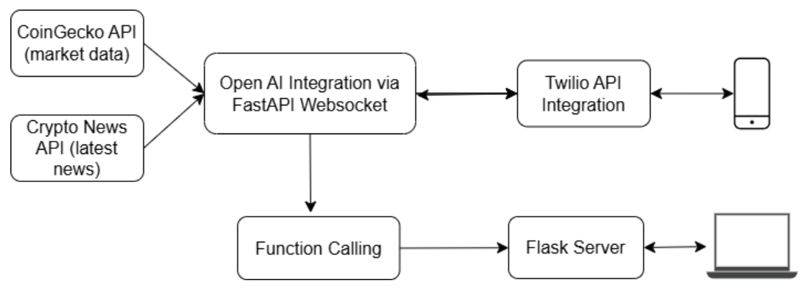

# Avalanche
[AI-Powered Crypto Trading Assistant](https://dorahacks.io/buidl/23539/)

This is Team Avalanche's submission, which secured second place in the Qube Trading and Research Challenge at HackTheBurgh XI.

---

## Key Features
1. Real-Time Market Insights:
Access up-to-date prices, trading volumes, and market sentiment to stay ahead of the curve.

2. Historical Trade Analysis:
Review your recent trades with detailed historical data, enabling you to optimize your strategies.

3. Crypto News Integration:
Stay informed on the latest developments and regulatory updates that impact your investments.

4. AI Phone Call Support: 
Get personalised trading advice and real-time market insights through an interactive phone call with the chatbot.

5. Interactive Dashboard:
Enjoy a visually engaging dashboard with dynamic charts and trend graphs, providing an all-in-one view of your trading activity and market trends.

## Technologies Used

Our system integrates multiple APIs and frameworks to provide real-time cryptocurrency insights, trading functionalities, and interactive chatbot capabilities.  



### Languages
- Python
- Typescript
- CSS

### APIs and Services  

- **[CoinGecko API](https://www.coingecko.com/en/api)** - Fetches real-time market data, including cryptocurrency values and market trends.  
- **[Crypto News API](https://cryptonews-api.com/)** - Provides the latest cryptocurrency news to keep users informed about market changes.
- **[OpenAI API](https://platform.openai.com/docs/models)** – Incorporates GPT-4o-mini for enhanced chatbot capabilities.
- **[Twilio API](https://www.twilio.com/en-us/voice)** – Enables real-time voice-based interaction with the chatbot via phone calls
- **FastAPI WebSocket** - Enables real-time interactions between the OpenAI chatbot and backend.
- **Flask Server** – Manages function calling and integration between the chatbot, APIs, and external services.

## Functionalities

### OpenAPI function tools

We implemented six custom function calls to build the chatbot’s capabilities:  

1. **`get_price`** - Retrieves the current price of a specified cryptocurrency based on its coin ID (e.g., `"bitcoin"`).  
2. **`get_trend`** - Fetches historical data for a given cryptocurrency to allow trend analysis.  
3. **`compare_trends`** - Compares trends across multiple cryptocurrencies to identify patterns and market movements.  
4. **`get_summary`** - Generates a brief summary of overall market conditions using available data.  
5. **`make_trade`** - Enables the execution of trades for specified cryptocurrencies.  
6. **`give_advice`** - Provides trade recommendations based on historical performance and market trends.  

### Backend Architecture

- **Flask Backend** - Manages function calling and integration between the chatbot and external APIs.  
- **FastAPI WebSocket** - Facilitates real-time data exchange between the OpenAI chatbot and the backend.  

### Phone Call Interface  

We integrated OpenAI function calls with Twilio API, allowing users to interact with the chatbot via phone calls. This feature provides real-time market insights and trade recommendations through a voice-based interface.

### Dashboard Interface

We built a dashboard using Typescript and CSS to visualise personalised real time Cryptocurrency and transaction data.

---

## Installation & Setup  

Follow these steps to run the project locally. The dashboard is divided into two parallel components:  
- **Backend**: Built with Python  
- **Frontend**: Managed via Node.js  

### Backend Setup  

1. **Install Dependencies**:  
   Ensure you have Python installed. Then, run the following command to install the necessary dependencies:  
   ```sh
   pip install -r requirements.txt
   ```

2. **Run the Backend**:
    Start the backend server by executing the command:
    ```sh
    python backend.py
    ```

### Frontend Setup 

1. **Install Node Modules**:
    Navigate to the frontend directory and install the required dependencies:
    ```sh
    npm install
    ```

2. **Run the Frontend**:
    Start the frontend development server with the following command:
    ```sh
    npm run dev
    ```
Both the frontend and backend should be run in parallel to ensure the application functions correctly.

### Phone call Setup
```sh
python chatbot/chat_manager.py
```